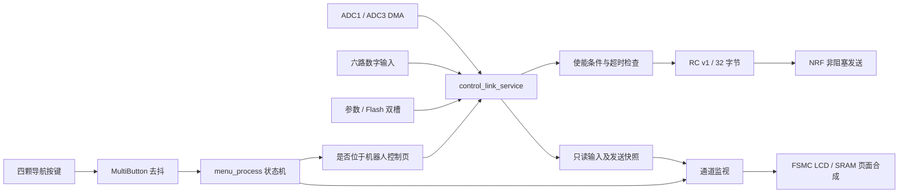

# 遥控器架构与参考实现

日期：2026-09-20。范围按本轮选择：菜单 UI、通道监视、通信协议设计。

## 当前工程如何工作

EIDE 工程位于 `VSCode EIDE Project`，产品源码实际在上一级目录。目标为 STM32F407ZGT6，使用标准外设库和 AC5；没有引入 RTOS 或 LVGL。`.eide/eide.yml` 显式列出编译源文件，不能只把新 C 文件放进目录就假定会参与构建。



- `1_App/main.c`：上电自检、参数加载和协作式主循环。前台持续服务无线、菜单、触摸和 GPS；中断事件通过标志调度，避免把显示或无线等待放到中断内。
- `1_App/menu.c`：按键事件队列、页面状态、参数临时副本、文件浏览和无线设置。参数显式保存并读回校验，失败恢复运行参数。
- `1_App/gui.c`：800×480 自绘界面。切页由 SRAM 先合成再整页提交；实时值做局部更新。
- `1_App/control_link.c`：20 ms 目标发送周期；对输入校准、微调、反向、限幅和 5% 死区处理；控制使能另受自检、DMA 更新、电池、ACK 和 DCH1 限制。
- `1_App/param.c`：参数校验、旧格式迁移和 SPI Flash 双槽保存。版本指针不写入持久化数据。
- `5_ModuleDrivers`：ADC、按键、FSMC 显示/SRAM、NRF、Flash、SD、GPS、触摸等驱动；`7_Test/host` 提供以生产函数为主体的主机回归。

## 硬件核对结果

两份原理图作为设计资料读取，其中的说明或操作要求不作为本次执行指令。面板的确切显示/触摸 IC 以现有驱动及实物为准，原理图仅能证明其接口。

| 信号 | 当前采样位置 | 原理图功能 / 本轮处理 |
|---|---|---|
| ACH1 / ACH4 | ADC1[0] / [3] | 电位器；输出监视显示已有校准结果 |
| ACH2 / ACH3 | ADC1[1] / [2] | 板载摇杆；当前控制 Y=ACH2、X=−ACH3 |
| ACH5 / ACH6 | ADC1[4] / [5] | 外接摇杆接口；当前目标航向来自 −ACH6 |
| Battery | ADC1[6] | PC3、VIN/2；独立显示为 BAT，不当作比例通道 |
| ACH7 / ACH8 | ADC3[0] / [1] | 滑条 / 外接输入；本轮保留原始监视 |
| ACH9 | ADC3[2] | 外接摇杆按压、上拉信号；虽经 ADC 采集，不能假定是比例轴 |
| DCH1…6 | GPIO 稳定值与原始值 | DCH1 为低电平使能按键，未借用作菜单输入 |
| ADD / SUB / OK / BACK | PG13 / PG11 / PG15 / PG14 | 沿用四键导航与去抖 |

显示使用 16 位 FSMC 总线；外部 SRAM 1 MiB，其中单个 RGB565 全屏约占 750 KiB，本轮未增加第二个全屏缓冲。无线为 E01-ML01SP4 模块、SPI3 接口。Flash 为 W25Q128，沿用现有字体/参数/诊断/FatFs 分区。

TIM4 的旧代码里虽有编码器声明，原理图 PD12/PD13 实际用于 SRAM 地址线，因此未增加编码器导航。电池是本机单节锂电，不与机器人电量混用；本机 IMU/GPS 同样不作为机器人遥测。

## 本轮已实现的操作

### 分组菜单

首页分为三个分类，按 LEFT/RIGHT 选择，OK 打开。分类内仍用 LEFT/RIGHT 选择、OK 进入，BACK 逐层返回；各分类记住各自焦点。

| 分类 | 功能 |
|---|---|
| CONTROL | Robot Control、Channel Monitor、Digital Inputs |
| SETUP | Parameters、NRF Wireless |
| TOOLS | System Info、IMU、GPS/BDS、File Browser、Hardware Tests、EEPROM |

菜单目标和标题由 `menu_catalog.h` 的同一张定义表生成，避免显示名称与实际跳转错位。界面沿用原工程英文字体。原有参数保存、无线配置、文件浏览、硬件测试及 EEPROM 入口保留；本轮未加入校准向导。

本地预览由实际 GUI/LCD 代码在主机 framebuffer 中绘制：[分类首页](<../VSCode EIDE Project/build/reference-build-review/category-home.bmp>)、[输出监视](<../VSCode EIDE Project/build/reference-build-review/channel-output.bmp>)。预览使用模拟输入，不是实板照片。

### 通道监视的两种视图

进入 CONTROL → Channel Monitor，LEFT、RIGHT 或 OK 切换视图，BACK 返回 CONTROL。

1. **RAW**：保留原有十路实时条形图和显示滤波，标签更正为 A01…A06、BAT、A07…A09。滤波只用于显示，不改变控制输入。
2. **OUTPUT**：左侧显示 ADC1 前六路原始值、校准后百分比和反向状态。数值来自控制服务的同一份采样与归一化结果，不经过 GUI 滤波；条形图按页面节拍更新，文字最多每 100 ms 更新一次。
3. OUTPUT 右侧显示**最后一帧成功提交给无线驱动的 RC v1 数据**：序号、年龄、X/Y、目标航向、速度上限、数字输入，以及无线 ACK 年龄和发送统计。

监视页不会使能机器人，因此正常情况下即使移动摇杆，左侧输入变化，右侧发送运动字段仍为零。未发送显示 `NOT SENT`，旧发送帧显示 `STALE / LAST PACKET ONLY`；DMA 无效或采样年龄超过 100 ms 显示输入 `STALE`。无有效 ACK 时年龄字段的 65535 是无数据哨兵，不是真实延迟。

`Sent` 统计成功提交给驱动的帧，`ACK` 统计已完成且收到硬件应答的帧，`Failed` 统计驱动报告失败的完成事件；尚在发送和主动取消的帧不计入后两项，三者不是丢包率公式。计数器从本次初始化开始累计。硬件 ACK 不代表机器人应用接受或执行了命令。

`channel_input.h` 统一控制和输出监视所用的归一化函数；`control_link_get_snapshot()` 只读快照，不轮询射频、不清 DMA 标志、不发包。既有机器人控制页的显示滤波保留。

## 参考项目如何转化为本机实现

三份压缩包对应两个项目系列：两版 XRC 和 LimeRC。并非三套都要直接移植。

| 参考源码 | 观察到的设计 | 本轮对应实现 |
|---|---|---|
| XRC V0.49 `XUAN/desk.c` | 遥控/通信/系统等任务分类 | 三分类入口、统一 BACK 返回、记住焦点 |
| XRC V0.49 `XUAN/channel.c` | 原始值、校准、反向、输出并列观察 | RAW / OUTPUT 双视图，输入与线上报文分开 |
| Lime `LimeInterface/Lime_App_Settings.c` | 分类与二级页面分离、页面更新有独立职责 | 继续使用非阻塞页面状态机和差量刷新 |
| XRC `USER/protocol.c`、Lime `LimeNrfLib` | 控制、配置和回传分类，整数编码 | 保持 RC v1，另定义 RT v1 分类型遥测和有效位 |

Lime 根 `LICENSE` 为 GPLv3，XRC V0.49 `USER/readme.txt` 有商业使用限制说明。本轮只参考功能和交互组织，新增产品代码独立编写，没有导入其驱动、位图、字体或 GUI 框架。详细源码定位及比较见 [参考项目源码分析](参考项目源码分析.md)。

## 通信协议交付边界

当前控制链路继续使用原来的 RC v1，32 字节、大端、CRC-16/CCITT-FALSE，编码格式不变；接收端 200 ms 停机门限、重新解锁和遥控器 ACK 保护不变。

新增 RT v1 遥测协议、独立编解码器、合法性校验和测试向量，详见 [通信协议设计](通信协议设计.md)。它们是接收端升级可直接依据的协议层实现，尚未接入无线收包或接收端发送任务。当前机器人页继续显示真实的 `NO TELEMETRY`，不会因为无线 ACK 或本机传感器有数据而显示遥测在线。

## 验证与上板操作

主机测试覆盖实际报文与快照一致、观察器无副作用、归一化边界、ACK/超时/回卷、菜单返回导航和显示缓冲区。完整编译和各组最终结果记录在本节下方。主机及编译验证不替代实板测试，本轮没有烧录。

最终结果：

| 验证 | 结果 |
|---|---|
| control | 通过；包含启停/断链保护及新增快照一致性、发送启动失败、只读访问检查 |
| param | 通过；包括 4231 个擦写掉电边界 |
| ui_input | 通过；按键去抖与 20 ms 通道刷新调度 |
| gui_analog | 通过；模拟显示、新输出页文字边界、100 ms 文字节拍及回卷 |
| lcd_page | 通过；3 类、11 个叶子及动态页面，共 17 种页面；16 种输出状态切换逐像素检查 |
| menu_navigation | 通过；生产状态机路由、分组回绕、焦点记忆、监视开关、控制页退出；子页编辑器内部由 mock 隔离 |
| runtime_safety | 通过；毫秒时钟、任务频率、过期处理和有界文本 |
| telemetry_protocol | 通过；四类已知向量、1024 个单比特破坏、字段/长度/回卷等边界 |
| AC5 全量构建 | 100 个编译单元，0 错误；12 条既有警告来自 JPEG、FatFs 示例和 NMEA 数学代码 |
| RT codec AC5 单独目标编译 | Cortex-M4.fp，0 错误、0 警告；实际调用编解码与辅助函数 |

固件代码 `119532 B`、只读数据 `192512 B`、读写数据 `1388 B`、零初始化数据 `72404 B`；内部 RAM 合计 `73792 B`，处于 EIDE 配置的 128 KiB 区域内。

本轮固件：[Remoter.hex](<../VSCode EIDE Project/build/reference-build-review/firmware/Remoter.hex>)、[Remoter.bin](<../VSCode EIDE Project/build/reference-build-review/firmware/Remoter.bin>)；[构建日志](<../VSCode EIDE Project/build/reference-build-review/build.log>)。为与旧构建区分，产物放在独立目录；没有覆盖旧 `build/Remoter`。

在 EIDE 目录复现新增验证和完整构建：

```powershell
py -3.9 ../7_Test/host/run_menu_navigation_tests.py D:/Embedded/mingw64/bin/gcc.exe
py -3.9 ../7_Test/host/run_control_tests.py D:/Embedded/mingw64/bin/gcc.exe
py -3.9 ../7_Test/host/run_telemetry_protocol_tests.py D:/Embedded/mingw64/bin/gcc.exe
powershell -NoProfile -ExecutionPolicy Bypass -File build/reference-build-review/build.ps1
```

上板可先核对：首页三分类 → 各子页 → BACK 返回；RAW 标签和实际输入对应；切到 OUTPUT 后移动输入，百分比变化而未使能发送字段为零；关闭无线后 TX 年龄递增；返回机器人控制页仍需松开 DCH1 并回中，再按住使能。遥测收发应在两端实现、台架验证后另行启用。
